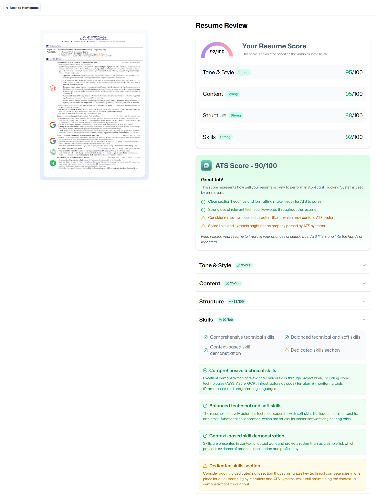

# 📝 AI Resume Analyzer

[](https://ai-resume-analyzer-100-7rj47.puter.site/)

Welcome to **AI Resume Analyzer** – your smart assistant for resume optimization! 🚀  
Upload your resume, get instant AI-powered feedback, and boost your chances of landing your dream job.

---

## 🌟 Features

- **🔐 Secure Authentication:** Login with Puter.js for a safe experience.
- **📤 Resume Upload:** Drag & drop PDF upload with instant preview.
- **🖼️ PDF to Image:** Converts your PDF resume to an image for visual feedback.
- **🤖 AI Analysis:** 
  - **ATS Compatibility:** See how your resume performs in Applicant Tracking Systems.
  - **Tone & Style:** Get feedback on professionalism and clarity.
  - **Content & Structure:** Suggestions for improvement and strengths.
  - **Skills Assessment:** Analyze your listed skills.
- **📊 Visual Feedback:** Score gauges, badges, and detailed breakdowns.
- **📝 Job Context:** Optionally provide job title and description for tailored feedback.
- **📂 Resume History:** Track all your analyzed resumes and revisit feedback anytime.
- **🧹 Data Wipe:** One-click option to clear all your uploaded data.

---

## 🛠️ Tech Stack & Usage

| Technology         | Usage                                                                 |
|--------------------|-----------------------------------------------------------------------|
|  | Frontend UI development                                              |
|  | Type safety across the codebase                                      |
|  | Routing and navigation                                    |
|  | Modern, utility-first CSS styling                                    |
|  | Lightweight state management                                         |
|  | PDF parsing and rendering                                            |
|  | Cloud storage, authentication, and AI chat integration               |
|  | Fast development server and build tool                               |


---

## 🖼️ Screenshots

### 🏠 Homepage


### 📈 Resume Score & Feedback


### 📤 Upload Resume


---

## 🚀 [Click here to try the live app!](https://ai-resume-analyzer-100-7rj47.puter.site/)

---

## 🏗️ How to Run Locally

1. **Clone the repository**
   ```sh
   git clone https://github.com/amanhaidry/ai-resume-analyzer.git
   cd ai-resume-analyzer
   ```

2. **Install dependencies**
   ```sh
   npm install
   ```

3. **Run the development server**
   ```sh
   npm run dev
   ```
   The app will be available at [http://localhost:5173](http://localhost:5173).

4. **Build for production**
   ```sh
   npm run build
   ```


---


Enjoy optimizing your resume and landing your dream